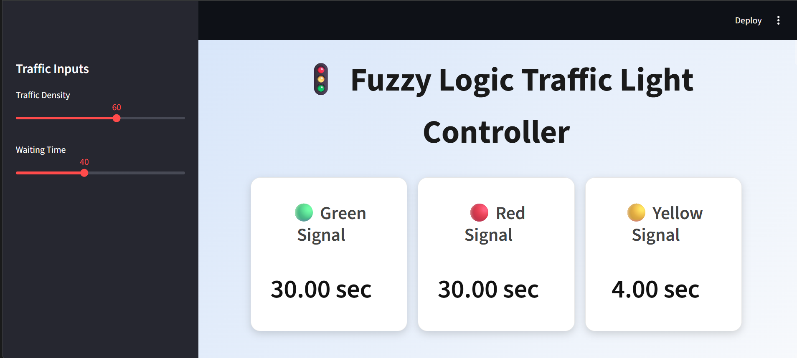

# 🚦 Fuzzy Logic Based Traffic Light Controller

A **smart traffic signal controller** built using **Fuzzy Logic** that dynamically adjusts traffic signal durations based on **traffic density** and **vehicle waiting time**.

This project demonstrates how **fuzzy inference systems** can be used to manage uncertain real-world conditions such as road traffic.

The system is implemented using **Python, Streamlit, and scikit-fuzzy**, and provides an interactive dashboard where users can simulate traffic scenarios.

---

# 🚀 Live Demo

Click below to open the deployed application:

🔗 **[Open Live Dashboard](https://fuzzy-logic-traffic-light-controller.onrender.com/)**

---

# 📊 Project Overview

Traditional traffic lights operate on **fixed timing**, which often leads to:

* unnecessary waiting
* traffic congestion
* inefficient traffic flow

This project introduces a **Fuzzy Logic Controller** that adapts signal timing dynamically based on real-time inputs.

### Inputs

* **Traffic Density** (0 – 100)
* **Waiting Time** (0 – 100)

### Outputs

* **Green Light Duration**
* **Red Light Duration**
* **Yellow Light Duration**

The fuzzy system processes these inputs using **membership functions and rules** to determine optimal signal timings.

---

# ⚙️ Features

✔ Interactive **Streamlit Dashboard**
✔ Adjustable **Traffic Density & Waiting Time sliders**
✔ Real-time **signal duration calculation**
✔ Visual **Traffic Signal representation**
✔ **Fuzzy Membership Function graphs**
✔ Clean and professional **UI dashboard**

---

# 🧠 Fuzzy Logic System

The system uses **fuzzy inference rules** to determine signal timings.

### Membership Sets

**Traffic Density**

* Low
* Medium
* High

**Waiting Time**

* Short
* Medium
* Long

**Signal Durations**

* Short
* Medium
* Long

The fuzzy controller evaluates these inputs and determines the most appropriate signal timing.

---

# 🛠️ Technology Stack

* **Python**
* **Streamlit**
* **NumPy**
* **scikit-fuzzy**
* **Matplotlib**

---

# 📁 Project Structure

```
fuzzy-traffic-light-controller
│
├── app.py
├── requirements.txt
├── README.md
├── dashboard.png
```

---

# 💻 Installation

Clone the repository:

```
git clone https://github.com/tripjotsingh2505/fuzzy-traffic-light-controller.git
cd fuzzy-traffic-light-controller
```

Install dependencies:

```
pip install -r requirements.txt
```

Run the application:

```
streamlit run app.py
```

---

# 🌐 Deployment

This project can be easily deployed using:

* **Streamlit Community Cloud**
* **Render** *(I personally used Render)*
* **Heroku**

Recommended platform: **Streamlit Cloud**

Steps:

1. Push the project to GitHub
2. Connect the repository to Streamlit Cloud
3. Deploy `app.py`

---

# 📷 Dashboard Preview



---

# 🎯 Learning Outcomes

This project demonstrates:

* Practical implementation of **Fuzzy Logic Systems**
* Building **interactive dashboards using Streamlit**
* Visualizing **membership functions**
* Creating **deployable data science applications**

---

# 👨‍💻 Author

**Tripjot Singh**

Data Analytics | Data Science | Machine Learning Enthusiast

GitHub:
https://github.com/tripjotsingh2505

---

# 📜 License

This project is created for **educational and learning purposes**.

Feel free to use and modify it.
